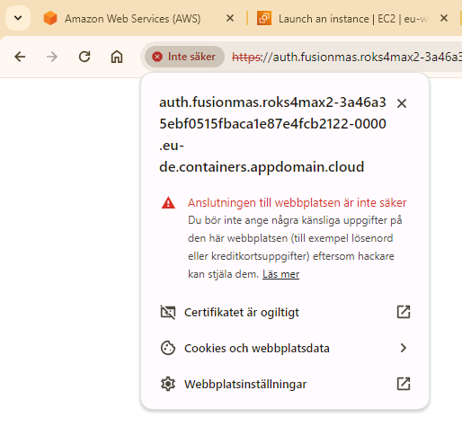

# Fixing certificate problems

In order to use MAS properly you need to have valid certificates. If you do not have this setup, you can try a workaround.  

## Windows
For example in Chrome,  
  
Click on the “Not secure” warning. Then click on “Not a valid certificate”.  
Switch to the “Info” tab and select the top certificate. Then export the certificate.  
  
Add the .crt extension and save.  
On Windows, double click the certificate.  
  
Install Certificate.  
  
Local machine.  
  
Install into Root Certificate Authorities. Next and Finish.  
Exit out and restart browser.

## Fedora or similar Linux

Follow the instructions for Windows to Export the certificate to your computer.  
Copy the certificate to /etc/pki/ca-trust/source/anchors/  
`sudo cp /home/fredrik/Downloads/public.fusionmas.mas.ibm.com.crt /etc/pki/ca-trust/source/anchors/`  
And update the ca-trust,  
`sudo update-ca-trust`  
Restart Browser.

## Still not working...
Click on the padlock and add a security exception, try to log in.  
If you still get the spinning circle, try the "API" trick.  
  
If you try to login with the following link and only get a spinning cirle,  
https://auth.fusiontest.apps.snoman22nr1.epicalfusion.com/login/#/form  
Change the URL to have api in the beginning in stead of the first word,  
https://api.fusiontest.apps.snoman22nr1.epicalfusion.com/login/#/form  
Add a security exception and try to log in again with the original link.