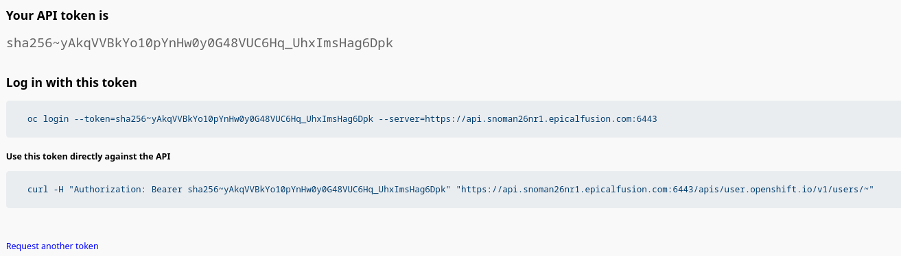

# Preparation before installing MAS

Before we install MAS we need to have an Entitlement Key and a license file.  
You get these from IBM or you generate them through an IBM site, this is not covered in my notes.
We also need Docker or Podman to get the MASCLI pod that will do the actual installation. The MASCLI pod contains all the Ansible scripts for installing MAS, Manage, IOT, Monitor etc.  
Copy the license file and the pull secret to a directory that you can share with Docker or Podman.  
Remove any previous copies of MASCLI and start a new pod.  

```
podman rm MASCLI
podman run -ti --name MASCLI -v /home/fredrik/MAS:/mnt/home --pull always quay.io/ibmmas/cli
```

In my case, I have the two files under /home/Fredrik/MAS and they are mounted in the /mnt/home directory in the pod.
In the pod command line, run the following,
```
cd
mkdir masdir
mkdir /opt/app-root/src/masconfig
cp /mnt/home/license.dat /opt/app-root/src/masconfig
cd /mnt/home/
```
This will copy the file to a specific location in the pod. This needs to be done each time you start a new pod.

In the pod, Log into the Openshift cluster  
In the upper right corner of the Openshift web console, click on your name  
  
Then select Copy login command  
Display token and copy the Login with this token row  
  
Log in to the Open Shift cluster py pasting the login token   

```
[fredrik@fedora ~]$ oc login --token=sha256~yAkqVVBkYo10pYnHw0y0G48VUC6Hq_UhxImsHag6Dpk --server=https://api.snoman26nr1.epicalfusion.com:6443
Logged into "https://api.snoman26nr1.epicalfusion.com:6443" as "bamse" using the token provided.

You have access to 78 projects, the list has been suppressed. You can list all projects with 'oc projects'

Using project "default".
[fredrik@fedora ~]$ 
```