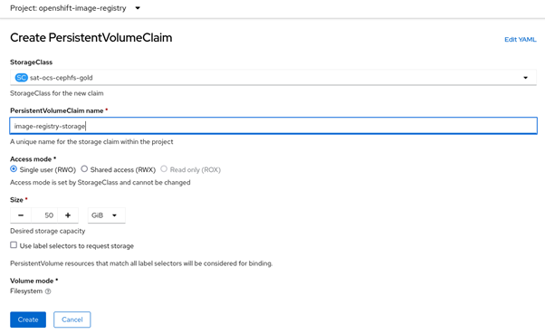
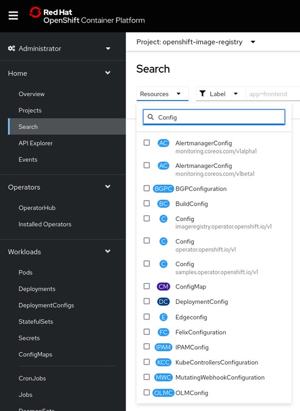
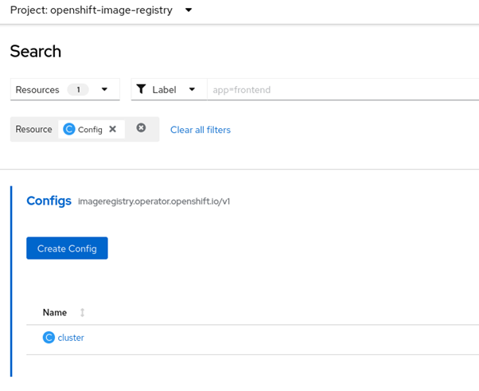
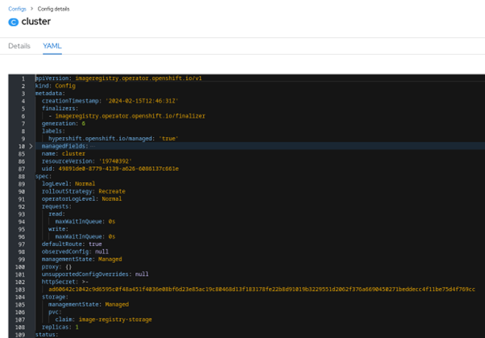

# Preparing the Image Registry

Before we start the install, we need to setup the Image registry, there are some generic instructions given in the MAS Devops Collection,  
https://www.ibm.com/docs/en/mas-cd/continuous-delivery?topic=installing-enabling-openshift-internal-image-registry

Here are the steps I did in our cluster, these were done in the Openshift Web Console on the Administrative view.  

## Create a PVC to hold image data

1. Go to Storage and then Persistent Volume Claims  
2. Filter by Projects and select “openshift-image-registry”  
3. Create a new PVC  
  

* name: image-registry-storage
* namespace: openshift-image-registry
* accessModes: - ReadWriteOnce
* storage: 50Gi
* storageClassName: sat-ocs-cephfs-gold
* volumeMode: Filesystem

4. Go to Home and search, expand resources and type in Config  
  

5. Click on “imageregistry.operator.openshift.io/v1”  
6. Click on Cluster  
  

7. Click on the YAML tab  
  

8. Edit the following parameters, add them if they do not exist  

```yaml
rolloutStrategy: Recreate
defaultRoute: true
managementState: Managed
Switch out the whole “Storage” section,
storage: 
    managementState: Managed
    pvc:
      claim: image-registry-storage
```

9. Save and wait a few minutes until the status section reflects the changes  

The “claim” parameter should be the name of the PVC we created earlier.
